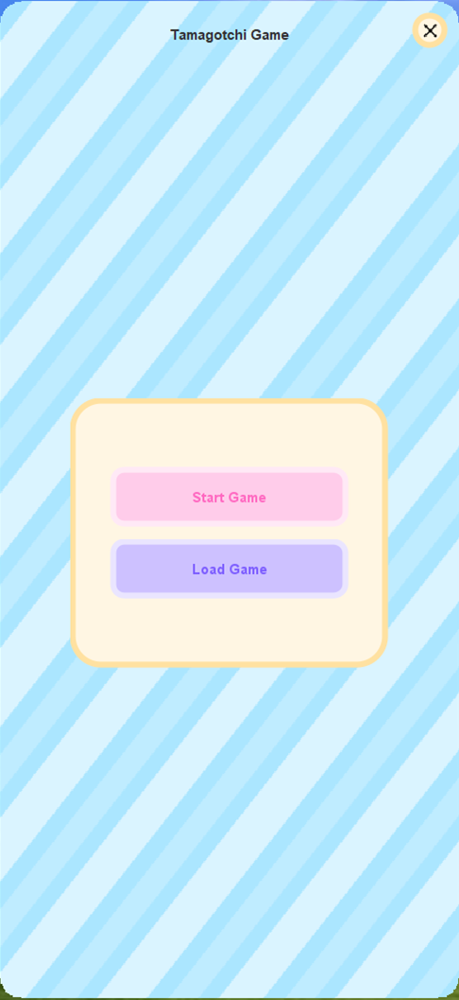
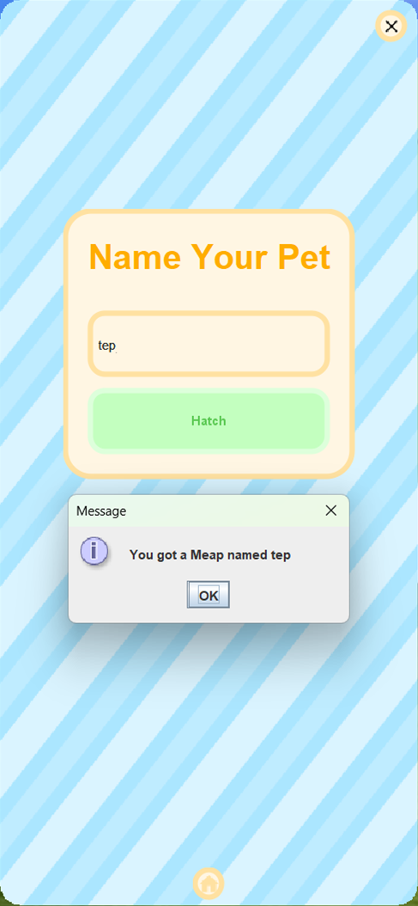
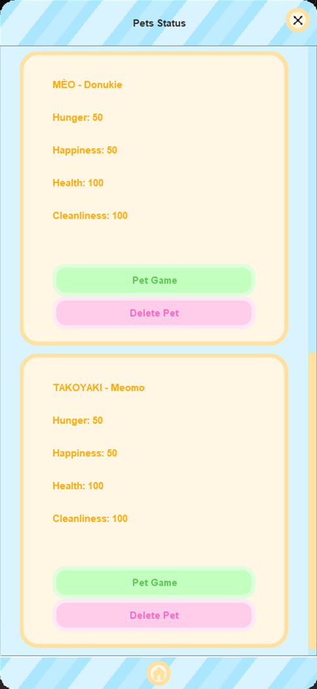
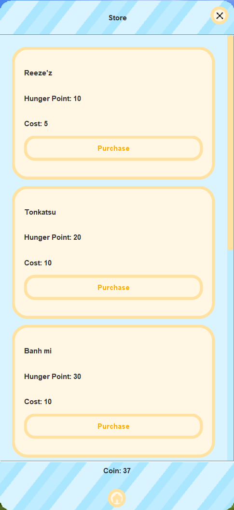
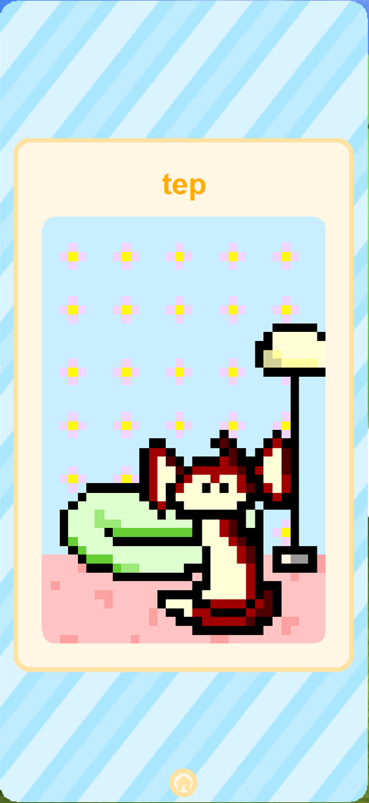
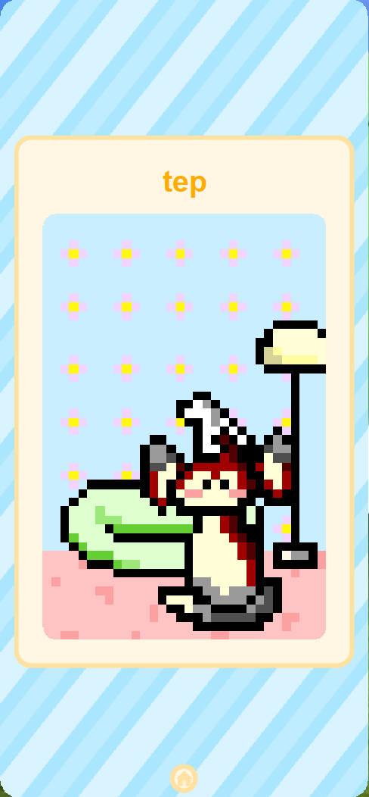
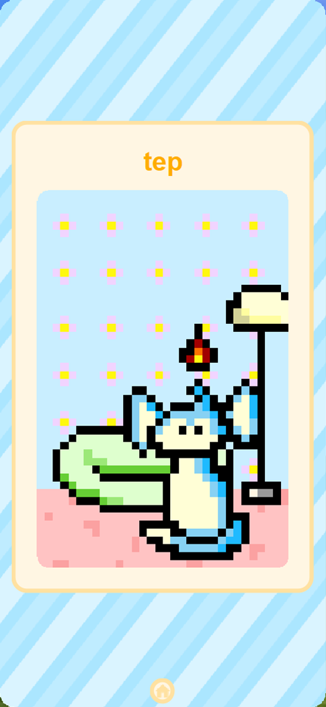
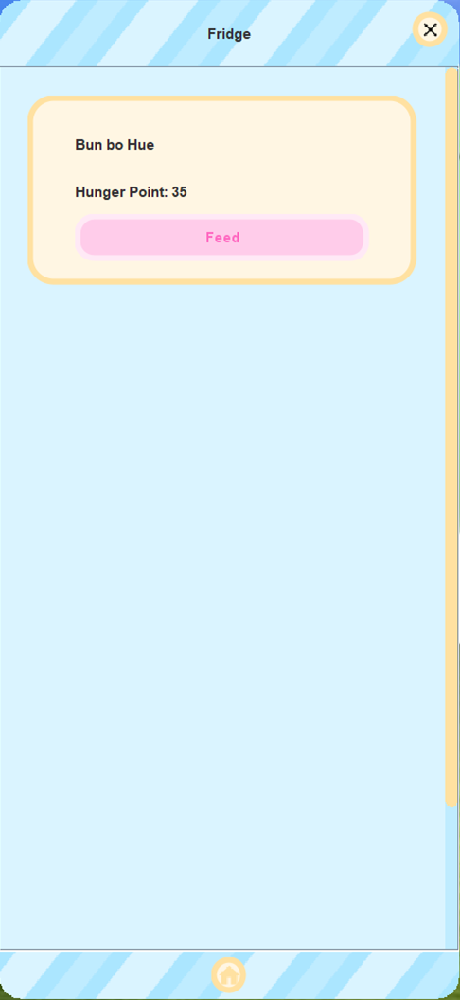
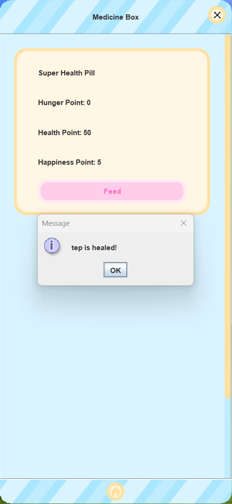
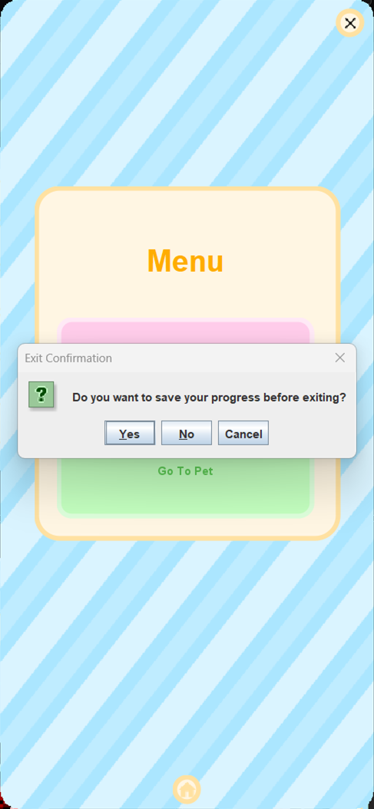

# Virtual Pet Game 🐾🕹️  
A Java-based Tamagotchi-style desktop game where you raise, care for, and interact with your own digital pet. Stay responsible — if you neglect your pet, consequences follow! 
Relive the charm of early digital pets with a modern twist. Inspired by Tamagotchi, this game lets you build emotional connections with your pet through an engaging, real-time simulation. Originally developed as a **CPSC210 (OOP Design)** course project at UBC.

### Key Features

##### 🐶 Pet Simulation  
- Adopt and name your own pet  
- Monitor health, hunger, happiness, and cleanliness  
- Perform daily actions: **feed, clean, play, heal**

##### 🍎 Inventory System  
- Store food in the fridge and medicine in the med box  
- Earn coins to buy supplies and manage inventory

##### 🔔 Smart Alerts  
- Get notified when your pet needs attention

##### 💾 Persistent Save  
- Save/load progress including pet status and items

---

## 🧱 Tech Stack

- **Language:** Java  
- **UI:** Java Swing  
- **Testing:** JUnit  

---

## 🚀 Getting Started

```bash
git clone https://github.com/anthu2708/TamagotchiGame.git
```
2. Run the main application file to start the game:
```bash
java ..\src\main\ui\gui\MainApp.java
```
3. Enjoy taking care of your virtual pet!

---

## Screenshot

### 🖼️ Screenshots

#### Main Screens

| Landing Page | Main Menu | Hatch Pet |
|--------------|-----------|-----------|
|  |  |  |

---

#### Pet System

| Pet House | Pet Status | Store |
|-----------|------------|-------|
|  |  |  |

---

#### Pet States

<p align="left">
  
  
  
  
</p>

---

##### Inventory & Save

| Fridge | Medicine Box | Save Game |
|--------|---------------|-----------|
|  |  |  |
