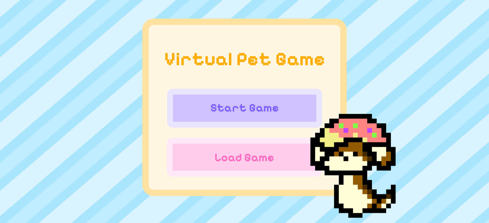

# Virtual Pet Game 🐾🕹️

**Raise, nurture, and care for your virtual pet!**  

This game brings back the nostalgic charm of Tamagotchi-style pet care, where you must keep your pet happy, healthy, and entertained. If neglected, your pet can become sick or even worse—so be a responsible owner and ensure your companion thrives!


---

## 🛠 Project Story
This project was created to recreate the joy of classic virtual pet games while introducing modern features that enhance the experience. Inspired by early handheld games, this simulation allows players to build emotional connections with their digital pets. This was created as a part of the UBC CPSC210 course, an object-oriented programming class focused on developing software design skills.

---

## 💡 Why This Game?
Caring for a virtual pet brings back fond memories of childhood, evoking the nostalgia of early digital companions like Tamagotchi. This project explores how contemporary gaming can enhance storytelling and player interaction while retaining the classic pet-care mechanics.

---

## 🚀 What It Does

Virtual Pet Game is an interactive simulation where players raise their own virtual pet. The goal is to nurture, feed, play with, and take care of your pet while managing resources.

### 🏡 **Pet Care System**
- Adopt and name your pet.
- Monitor your pet’s health, happiness, hunger, and cleanliness levels.
- Perform daily actions: **feed, play, clean, and heal** your pet.

### 🍎 **Inventory Management**
- Store food in the fridge and medicine in the medicine box.
- Earn coins by taking good care of your pet and use them to buy supplies.
- Track inventory and restock when needed.

### 🔔 **Smart Notifications**
- Receive alerts when your pet needs attention or falls ill.
- Make quick decisions to prevent your pet from getting sick.

### 💾 **Save & Load Progress**
- Save game progress, including pets and inventory, before quitting.
- Load saved progress upon starting the game.

---

## 🔑 Key Features

- **Interactive Pet Simulation:** Experience the joy of raising a digital pet.  
- **Engaging Gameplay Loop:** Keep track of pet needs, earn coins, and manage inventory.  
- **Immersive Experience:** Notifications ensure you never forget about your pet.  

---

## 🏗️ Built With 

- **Language:** Java  
- **GUI Framework:** Java Swing for the user interface.  
- **Testing:** JUnit for unit testing to ensure code reliability.  

---

## 🏁 Getting Started

1. Clone the repository to your local machine.
```bash
git clone https://github.com/anthu2708/TamagotchiGame.git
```
2. Run the main application file to start the game:
```bash
java ..\src\main\ui\gui\MainApp.java
```
3. Enjoy taking care of your virtual pet!

---

## Screenshot

##### Landing Page


##### Main menu


##### Hatch (add) Pet


##### Pets Menu


##### Pet Screen (with different state)


##### Pet Status Screen


##### Store screen


##### Fridge 


##### Medicine Box


##### Save Game Screen


